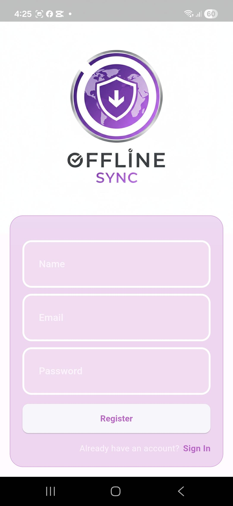
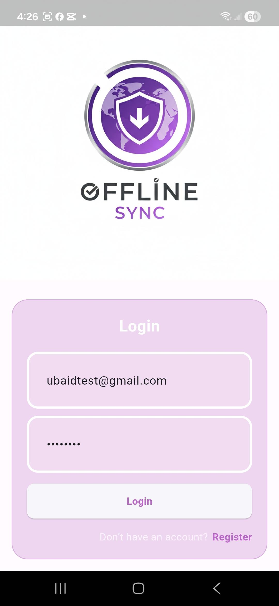
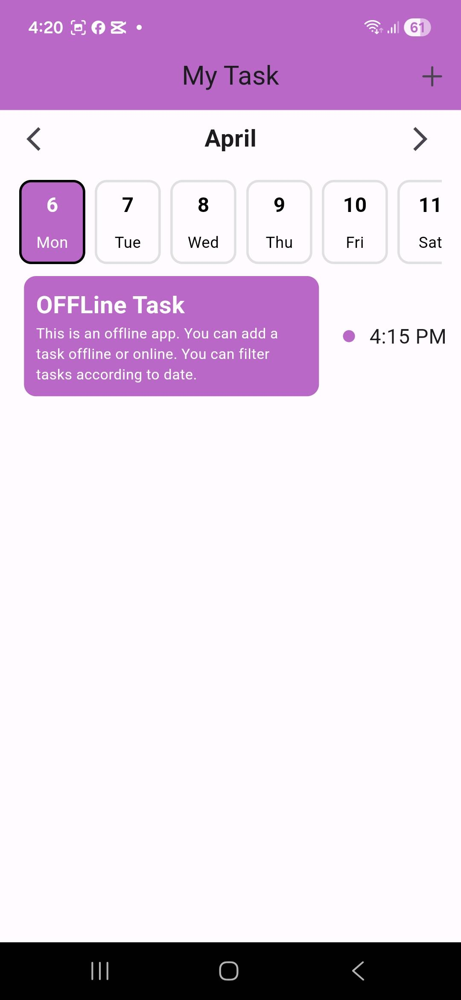

# Offline Task App

<table align="center">
  <tr>
    <td align="center">
      <br>
      <sub><b>Register</b></sub>
    </td>
    <td align="center">
      <br>
      <sub><b>Add Task</b></sub>
    </td>
   
  </tr>

  
  <tr>
      <td align="center">
      <br>
      <sub><b>Login</b></sub>
    </td>
    <td align="center">
      <br>
      <sub><b>Show Task</b></sub>
    </td>
  </tr>
</table>


A cross-platform task management app built with **Flutter**, following **MVVM architecture** and **Bloc/Cubit state management**, designed for **offline-first usage**. Users can **register and login securely**, with their login state and tasks **persisted locally using SQLite** for offline access. The app allows **adding, editing, and deleting tasks offline**, with the ability to **filter tasks by date** for better organization. It uses **Bloc/Cubit** for scalable and maintainable state management and integrates with a **Node.js backend** built with **TypeScript**, **Express**, and **PostgreSQL** for online synchronization. The backend and database are **containerized using Docker** for easy deployment.

---

## 🚀 Features

- **User Authentication:** Register and login securely.  
- **Offline Persistence:** Keep login state and tasks stored locally using SQLite.  
- **Task Management:** Add, edit, and delete tasks offline.  
- **Task Filtering:** Filter tasks by date to organize tasks efficiently.  
- **State Management:** Uses Bloc/Cubit for scalable and maintainable code.  
- **Backend Sync:** Node.js backend with TypeScript, Express, and PostgreSQL for online synchronization.  
- **Containerized Deployment:** Backend and database easily deployable via Docker.  

---

## 🛠️ Tech Stack

| Layer | Technology |
|-------|------------|
| Frontend | Flutter, Dart, MVVM, Bloc/Cubit |
| Backend | Node.js, TypeScript, Express, PostgreSQL |
| Local Database | SQLite |
| Containerization | Docker |

---

## 💻 Installation

### Backend
1. Clone the backend repository:
   ```bash
   git clone https://github.com/ubaidkhan321/OFFLINE_TASK_APP.git backend
   
